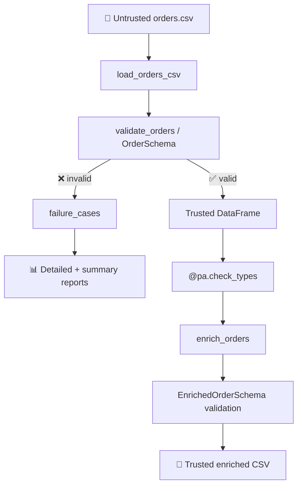

# 🛡️ Pandera Data Quality Lab

[](https://www.python.org/)
[](LICENSE)
[](.github/workflows/ci.yml)
[](pyproject.toml)

> **A problem-driven, step-by-step educational project** for learning **Pandera**, **pandas**, executable **data contracts**, and production-style **data quality engineering**.
>
> Starting from an untrusted, messy CSV, we progressively build a reliable data validation and transformation pipeline.

---

## 🎯 Problem Statement

An analytics team receives `orders.csv` from an upstream service. The incoming raw data may contain:

```text
❌ Wrong data types             ❌ Missing values (nulls)
❌ Duplicate order IDs          ❌ Invalid categorical values
❌ Invalid calendar dates       ❌ Unexpected metadata columns
❌ Incorrect monetary totals
```

**Downstream analytical pipelines should never blindly trust this raw source.**

---

## 🏗️ Architecture



### Key Design Decision

| Failure Category | Meaning | System Behavior |
|---|---|---|
| **Bad source data** | Expected operational occurrence | Structured error reports, no trusted output generated |
| **Bad transformation output** | Programming/logic defect | Exception propagates immediately; never masked |

---

## 📚 7-Phase Learning Path

| Phase | Question / Challenge | Core Concepts |
|:---:|---|---|
| 1️⃣ | Why can’t we trust raw CSVs? | Data contracts, manual inspection vs automated checks |
| 2️⃣ | How do we define our first schema? | `DataFrameModel`, `Field`, dtype & range validation |
| 3️⃣ | How do we handle real-world messy input? | Type coercion, null policies, lazy validation, error reporting |
| 4️⃣ | What if columns are valid individually but inconsistent together? | Custom single-column (`@pa.check`) & cross-column (`@pa.dataframe_check`) rules |
| 5️⃣ | How do contracts protect transformations? | `DataFrame[Schema]`, `@pa.check_types`, typed input/output boundaries |
| 6️⃣ | How do we prevent regressions? | Test architecture, fixtures, code coverage, CI automation |
| 7️⃣ | Can we explain and extend the system? | Architecture design, cheat sheet, capstone challenge |

> 📖 Get started with [`START_HERE.md`](START_HERE.md).

---

## 🔧 Installation & Quick Start

```bash
# 1. Install package in editable mode with dev dependencies
python -m pip install -e ".[dev]"

# 2. Run the end-to-end pipeline example
python examples/phase5_run_pipeline.py

# 3. Run unit and integration tests
python -m pytest -q

# 4. Run the local quality gate (lint + test + coverage)
python scripts/quality_gate.py

# 5. Launch interactive notebooks
jupyter lab
```

---

## 📦 Core Data Contract

```python
class OrderSchema(pa.DataFrameModel):
    order_id:    Series[int]      = pa.Field(unique=True, nullable=False, coerce=True)
    customer_id: Series[str]      = pa.Field(nullable=False)
    product_id:  Series[str]      = pa.Field(nullable=False)
    quantity:    Series[int]      = pa.Field(gt=0, nullable=False, coerce=True)
    unit_price:  Series[float]    = pa.Field(gt=0, nullable=False, coerce=True)
    discount:    Series[float]    = pa.Field(ge=0, le=1, nullable=False, coerce=True)
    total:       Series[float]    = pa.Field(nullable=False, coerce=True)
    status:      Series[str]      = pa.Field(isin=ALLOWED_ORDER_STATUSES, nullable=False)
    order_date:  Series[DateTime] = pa.Field(nullable=False, coerce=True)
```

Includes custom non-blank string checks on identifiers and cross-column business formula validation for order totals with floating-point tolerance.

## 🔄 Typed Transformation

```python
@pa.check_types(lazy=True)
def enrich_orders(
    df: DataFrame[OrderSchema],
) -> DataFrame[EnrichedOrderSchema]:
    ...
```

Derived features validated by `EnrichedOrderSchema`:

| Derived Field | Calculation / Meaning |
|---|---|
| `gross_amount` | `unit_price * quantity` |
| `discount_amount` | `gross_amount * discount` |
| `net_amount` | `total` (equals `gross_amount - discount_amount`) |
| `order_month` | `YYYY-MM(order_date)` |
| `is_discounted` | `discount > 0` |

---

## 🗂️ Project Structure

```text
pandera-data-quality-lab/
├── .github/workflows/ci.yml    # CI pipeline (GitHub Actions)
├── data/
│   ├── raw/                    # Raw untrusted test data (with anomalies)
│   ├── reference/              # Known-good reference dataset
│   └── clean/                  # Enriched clean output directory
├── notebooks/                  # 7 progressive Jupyter notebooks
├── docs/                       # Detailed lessons, architecture & cheat sheet
├── challenges/                 # Problem-driven hands-on exercises
├── interview/                  # 160+ interview prep questions by phase
├── solutions/                  # Reference solutions & answer guides
├── examples/                   # Standalone runnable Python scripts
├── scripts/quality_gate.py     # Local quality verification script
├── src/pandera_lab/
│   ├── schemas/                # OrderSchema, EnrichedOrderSchema, historical schemas
│   ├── business_rules.py       # Pure domain calculations & tolerance logic
│   ├── ingestion.py            # CSV loading utility
│   ├── validation.py           # Validation boundary & result encapsulation
│   ├── reporting.py            # Structured failure reporting
│   ├── transformations.py      # Typed feature engineering
│   └── pipeline.py             # End-to-end pipeline orchestration
├── tests/                      # 60 pytest tests (>91% coverage)
└── pyproject.toml              # Build config & dependencies
```

## 🎓 Educational Stability

As the production-facing `OrderSchema` evolves, earlier notebooks remain pinned to frozen historical contracts:

```text
Phase2OrderSchema   →  notebook 02
Phase3OrderSchema   →  notebook 03
Phase4OrderSchema   →  notebook 04
```

This guarantees that earlier exercises remain fully reproducible without unexpected behavior changes as later features are introduced.

## 📋 Reference Guides

- **Syntax & Decision Cheat Sheet**: [`docs/cheat_sheet.md`](docs/cheat_sheet.md)
- **Portfolio & Interview Discussion Guide**: [`docs/portfolio_guide.md`](docs/portfolio_guide.md)
- **Architecture Overview**: [`docs/07_architecture.md`](docs/07_architecture.md)

## ⚠️ Scope & Limitations

This repository demonstrates data contract design and engineering discipline on small synthetic datasets. It is designed for educational, portfolio, and best-practice demonstration purposes rather than high-throughput production deployment.

## 📄 License

[MIT](LICENSE) © mahan-vzmz
