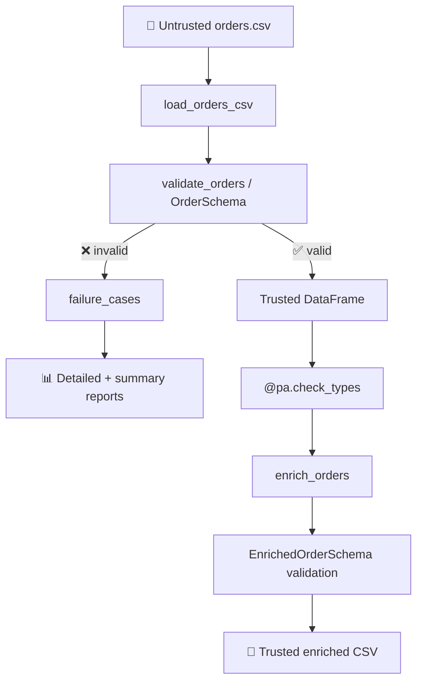

# 🛡️ Pandera Data Quality Lab

[](https://www.python.org/)
[](LICENSE)
[](.github/workflows/ci.yml)
[](pyproject.toml)

> **یک مینی‌پروژه آموزشی گام‌به‌گام** برای یادگیری **Pandera**، **pandas** و اصول مهندسی کیفیت داده.
>
> از یک فایل CSV نامعتبر شروع می‌کنیم و قدم‌به‌قدم یک pipeline قابل اعتماد می‌سازیم.

---

## 🎯 مسئله

یک تیم تحلیل داده فایل `orders.csv` رو از یک سیستم بالادستی دریافت می‌کنه. این فایل ممکنه شامل مشکلات زیر باشه:

```
❌ نوع داده اشتباه          ❌ مقادیر گمشده
❌ شناسه‌های تکراری          ❌ دسته‌بندی نامعتبر
❌ تاریخ‌های نامعتبر         ❌ ستون‌های اضافه
❌ محاسبات مالی اشتباه
```

**سیستم‌های downstream هرگز نباید کورکورانه به این داده اعتماد کنن.**

---

## 🏗️ معماری نهایی



### تصمیم طراحی کلیدی

| نوع شکست | معنا | واکنش |
|---|---|---|
| **داده ورودی بد** | نتیجه عملیاتی مورد انتظار | گزارش ساختاریافته، بدون خروجی |
| **خروجی تبدیل بد** | باگ برنامه‌نویسی | exception فوری، هرگز پنهان نشه |

---

## 📚 مسیر یادگیری ۷ فازی

| فاز | سؤال | چی یاد می‌گیری |
|:---:|---|---|
| 1️⃣ | چرا نمی‌تونیم به CSV اعتماد کنیم؟ | data contracts، بررسی داده |
| 2️⃣ | چطور اولین قرارداد رو بنویسیم؟ | `DataFrameModel`، `Field` |
| 3️⃣ | با ورودی واقعی چیکار کنیم؟ | coercion، null، lazy validation |
| 4️⃣ | اگه ستون‌ها جدا درست ولی با هم ناسازگار باشن؟ | custom/cross-column checks |
| 5️⃣ | چطور قرارداد تبدیل‌ها رو محافظت کنه؟ | `DataFrame[Schema]`، `check_types` |
| 6️⃣ | چطور از regression جلوگیری کنیم؟ | test architecture، coverage، CI |
| 7️⃣ | آیا می‌تونیم سیستم رو توضیح بدیم و گسترش بدیم؟ | architecture، capstone |

> 📖 از [`START_HERE.md`](START_HERE.md) شروع کن.

---

## 🔧 نصب و اجرا

```bash
# نصب
python -m pip install -e ".[dev]"

# اجرای pipeline
python examples/phase5_run_pipeline.py

# اجرای تست‌ها
python -m pytest -q

# اجرای quality gate
python scripts/quality_gate.py

# اجرای notebook‌ها
jupyter lab
```

---

## 📦 قرارداد اصلی داده

```python
class OrderSchema(pa.DataFrameModel):
    order_id:    Series[int]      = pa.Field(unique=True, nullable=False, coerce=True)
    customer_id: Series[str]      = pa.Field(nullable=False)
    product_id:  Series[str]      = pa.Field(nullable=False)
    quantity:    Series[int]      = pa.Field(gt=0, nullable=False, coerce=True)
    unit_price:  Series[float]    = pa.Field(gt=0, nullable=False, coerce=True)
    discount:    Series[float]    = pa.Field(ge=0, le=1, nullable=False, coerce=True)
    total:       Series[float]    = pa.Field(nullable=False, coerce=True)
    status:      Series[str]      = pa.Field(isin=ALLOWED_ORDER_STATUSES, nullable=False)
    order_date:  Series[DateTime] = pa.Field(nullable=False, coerce=True)
```

به‌علاوه بررسی non-blank بودن شناسه‌ها و فرمول محاسبه total.

## 🔄 تبدیل تایپ‌شده

```python
@pa.check_types(lazy=True)
def enrich_orders(
    df: DataFrame[OrderSchema],
) -> DataFrame[EnrichedOrderSchema]:
    ...
```

فیلدهای خروجی:

| فیلد | فرمول |
|---|---|
| `gross_amount` | `unit_price × quantity` |
| `discount_amount` | `gross_amount × discount` |
| `net_amount` | `total` |
| `order_month` | `YYYY-MM(order_date)` |
| `is_discounted` | `discount > 0` |

---

## 🗂️ ساختار پروژه

```
pandera-data-quality-lab/
├── .github/workflows/ci.yml    # CI pipeline
├── data/
│   ├── raw/                    # داده خام نامعتبر
│   ├── reference/              # داده مرجع معتبر
│   └── clean/                  # خروجی تولیدشده
├── notebooks/                  # 7 notebook آموزشی
├── docs/                       # درس‌ها + معماری + cheat sheet
├── challenges/                 # تمرین‌های عملی
├── interview/                  # سؤالات مصاحبه
├── solutions/                  # پاسخ‌های مرجع
├── examples/                   # اسکریپت‌های نمونه
├── scripts/quality_gate.py     # quality gate لوکال
├── src/pandera_lab/
│   ├── schemas/                # OrderSchema + EnrichedOrderSchema
│   ├── business_rules.py       # منطق دامنه
│   ├── ingestion.py            # بارگذاری CSV
│   ├── validation.py           # مرز اعتبارسنجی
│   ├── reporting.py            # گزارش خطاها
│   ├── transformations.py      # تبدیل تایپ‌شده
│   └── pipeline.py             # ارکستراسیون end-to-end
├── tests/                      # 60 تست (91%+ پوشش)
└── pyproject.toml
```

## 🎓 پایداری آموزشی

اسکیمای فعلی تکامل پیدا می‌کنه، ولی notebook‌های قدیمی از اسکیماهای تاریخی فریزشده استفاده می‌کنن:

```
Phase2OrderSchema   →  notebook 02
Phase3OrderSchema   →  notebook 03
Phase4OrderSchema   →  notebook 04
```

این تضمین می‌کنه که درس‌های قدیمی بدون تغییر رفتار قابل اجرا بمونن.

## 📋 Quick Reference

برای خلاصه سینتکس و تصمیم‌ها: [`docs/cheat_sheet.md`](docs/cheat_sheet.md)

برای راهنمای رزومه و مصاحبه: [`docs/portfolio_guide.md`](docs/portfolio_guide.md)

## ⚠️ محدودیت‌ها

این ریپازیتوری طراحی data-contract و اصول مهندسی رو روی دیتاست‌های کوچک سینتتیک نشون می‌ده. ادعای throughput پروداکشن، reliability استقرار، نتایج بنچمارک، یا صفر باگ **نمی‌کنه**.

## 📄 License

[MIT](LICENSE) © mahan-vzmz
