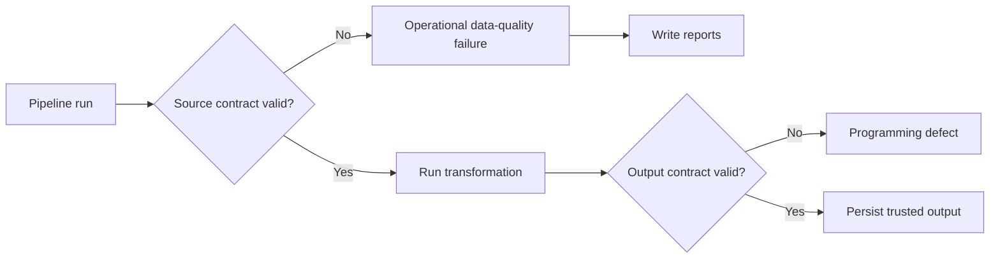

# Final Architecture

## System view

```mermaid
flowchart TD
    A[Untrusted orders.csv] --> B[load_orders_csv]
    B --> C[validate_orders]
    C -->|invalid| D[SchemaErrors / failure_cases]
    D --> E[Detailed error report]
    D --> F[Summary report]
    C -->|valid| G[OrderSchema trusted dataframe]
    G --> H[@pa.check_types input contract]
    H --> I[enrich_orders]
    I --> J[@pa.check_types output contract]
    J --> K[EnrichedOrderSchema]
    K --> L[Trusted analytics CSV]
```

## Contract layers

### Source boundary — `OrderSchema`

Protects:

- required columns and dtypes,
- coercion decisions,
- null policy,
- uniqueness,
- categorical domains,
- non-blank identifiers,
- cross-column total formula,
- unexpected source metadata filtering.

### Internal function boundary — `DataFrame[Schema]`

Protects transformation preconditions and postconditions.

```python
@pa.check_types(lazy=True)
def enrich_orders(
    df: DataFrame[OrderSchema],
) -> DataFrame[EnrichedOrderSchema]:
    ...
```

### Output boundary — `EnrichedOrderSchema`

Protects both structure and meaning of derived analytics fields.

## Failure taxonomy



This separation is deliberate: source failures are expected operational events; output-contract failures after trusted input are engineering defects.

## Data flow ownership

| Layer | Input trust | Responsibility | Failure output |
|---|---|---|---|
| ingestion | untrusted | preserve raw source representation | I/O exception |
| validation | untrusted | enforce source contract | structured failure cases |
| transformation | trusted | derive analytics fields | exception if code breaks contract |
| persistence | trusted | write validated output | I/O exception |
| CI | codebase | prevent regressions | failed quality gate |

## Historical learning architecture

The production schema evolves, but old lessons are pinned to:

```text
Phase2OrderSchema
Phase3OrderSchema
Phase4OrderSchema
```

This prevents an educational anti-pattern: changing today’s production rule and accidentally rewriting what an earlier notebook was supposed to demonstrate.
